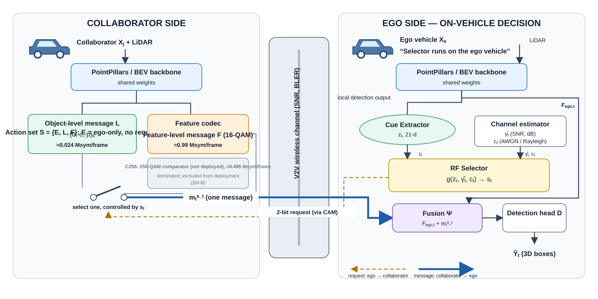

# CA-TOSG (Channel-Aware Task-Oriented Semantic Granularity Selection for V2V Cooperative Perception)

_All mainline results use the single-collaborator protocol; exceptions (SECOND appendix, Where2comm reference) are labeled where they appear. Tag `pre-p0-corrigendum` marks the pre-correction state._

[](LICENSE)

Per-frame selection of *how much semantics to transmit* in vehicle-to-vehicle cooperative
perception, under a prespecified average communication budget.

## Overview



## Main idea

The ego vehicle decides, **once per frame**, between three message granularities, using only what
it already has on the ego side — task cues from its own detection, an estimated SNR, and the
channel state:

| Action | Message | Channel use |
|---|---|---|
| **E** | ego-only, transmit nothing | 0 |
| **L** | object-level (boxes + scores) | 0.024 Msym |
| **F** | feature-level (compressed BEV features) | 0.99 Msym |

A feature message is worth its 41× cost only when the channel will actually deliver it *and* the
frame is one where cooperation helps. A random forest over 23 ego-side cues makes that call per
frame; the physical layer (5G-LDPC rate-1/2 + 16/256-QAM, Sionna frame-level BLER) decides whether the
chosen high-payload message is delivered, with ego-only as the failure fallback; the 2-bit request
itself rides the protected low-rate path and is not what the BLER model gates. One model is frozen per budget.

## Results

Held-out **test** split, 200-realisation deployment (per frame SNR ~ U[0,20] dB, Rayleigh with
probability 0.5), against the nominal SNR-threshold policy tuned to the same budget. Payload in
Msym/frame. All numbers regenerated from the frozen products by `tools/build_paper_tables.py`
and re-derived at gate time by `tests/test_canonical_quantities.py`.

| B_max | policy | F1 | payload | AP@0.5 |
|---|---|---|---|---|
| 0.10 | CA-TOSG | 0.8915 | **0.0368** | 0.8697 |
| 0.10 | SNR-threshold (nominal) | 0.8925 | 0.0724 | -- |
| 0.20 | CA-TOSG | 0.8969 | **0.1414** | 0.8742 |
| 0.20 | SNR-threshold (nominal) | 0.8970 | 0.2168 | -- |
| 0.30 | CA-TOSG | 0.8978 | **0.2120** | 0.8742 |
| 0.30 | SNR-threshold (nominal) | 0.8990 | 0.3125 | -- |

Reference points on the same split: Fixed-L AP@0.5 = 0.8691, feature-ceiling =
0.8931, ego-only = 0.7350 (headroom 0.0240).

**Channel-use saving at B_max = 0.20, on two tracks.** Against the *nominal* threshold the
selector spends **34.8% less** channel use -- but that
threshold is itself over budget (0.2168 > 0.20 Msym). Against
`tau_feasible`, the strictly budget-matched threshold, the saving is
**26.6%** and the F1 comparison turns in the
selector's favour (+0.00067). Quote both or neither.

Sources: `results/main/replay_summary.csv`, `results/main/true_e2e_ap.csv`,
`results/main/tau_feasible.csv`, `results/main/fixed_references.csv`. Every number in the
manuscript is indexed by `docs/claims.md`; every result file by `results/README.md`.

## Installation

```bash
conda env create -f environment.yml && conda activate catosg
```

Full instructions, including the sibling OpenCOOD checkout this repository evaluates against:
`docs/installation.md`.

## Dataset

OPV2V. Download, the expected directory layout, and the per-frame cue CSVs the selector trains on:
`docs/dataset.md`.

## Getting started

```bash
python tools/prepare_data.py          # frame x SNR x channel grid + scene manifest
python tools/train_selector.py        # LOSO selection + freeze, one model per budget
python tools/evaluate_selector.py     # 200-realisation deployment replay
```

Shortest path from raw OPV2V to the table above: `docs/getting_started.md`.

## Model Zoo

Three frozen selectors, one per budget. sha256, hyper-parameters and the full freeze record:
`docs/model_zoo.md`. The table below is written by `tools/build_readme_tables.py` from
`results/manifests/FROZEN_MANIFEST.json`; do not edit it by hand.

| B_max (mean Msym/frame) | model | λ\* | τ\* | LOSO OOF F1 | frozen validate payload |
|---|---|---|---|---|---|
| 0.10 | `selector_B010` | 0.05 | 18.0 dB | 0.8555 | 0.080803 |
| 0.20 | `selector_B020` | 0.02 | 12.0 dB | 0.8606 | 0.150158 |
| 0.30 | `selector_B030` | 0.00 | 8.0 dB | 0.8622 | 0.201607 |

## Reproduction

```bash
python tools/build_bler_table.py      # physical layer: Sionna 5G-LDPC + QAM BLER tables
python tools/evaluate_ap.py           # true end-to-end AP under the frozen selectors
python tools/run_sensitivity.py       # the sensitivity items
python tools/run_baselines.py contextual_bandit --train --evaluate
python tools/generate_figures.py      # every figure main.tex includes
python tools/verify_results.py        # all 26 gates (--content-only = the 14 a clean clone can run)
python tools/apply_opencood_patches.py --check   # the OpenCOOD modifications this project needs
```

The protocol these commands implement — split roles, candidate set, selection and freeze rules —
is `docs/experiment_protocol.md`, and it is the only normative source. `projects/ca_tosg/configs/*.yaml`
are generated from it; `tests/test_manifest.py` re-checks the md5 of every protocol block a config
claims to come from, and byte-compares the regenerated files, so the two cannot drift.

## License

Apache-2.0 — see [`LICENSE`](LICENSE). Copyright 2026 Peiyi Yue, University of Bristol.
The OpenCOOD code this work builds on carries its own licence in the sibling checkout.

## Citation

```bibtex
@unpublished{yue2026catosg,
  author = {Yue, Peiyi},
  title  = {Task-Oriented Semantic Granularity Selection for Bandwidth-Constrained
            V2V Cooperative Perception},
  note   = {Manuscript in preparation, University of Bristol},
  year   = {2026}
}
```

<sub>`paper2/` and `paper3/` are empty placeholders for future work and are untouched by this
layout.</sub>
